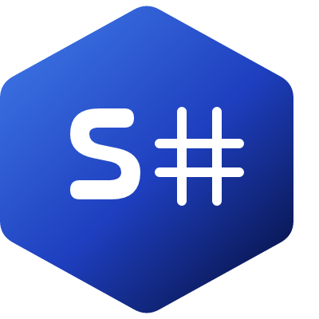

# S#

> A modern scientific computing language, inspired by Fortran, built natively for .NET.



**S#** (`.ssharp` / `.ss` — unofficially "Science sharp") is a programming language for scientific and numerical computing, built from scratch to target the CLR. It is not a Fortran port: Fortran provides the syntactic and semantic foundation — static types, arrays as a true first-class construct, `elemental` procedures, array-section syntax — but the intent is to grow S# well beyond that foundation over time, the same way [voyage-lang](https://github.com/voyage-org/voyage-lang) treats Swift as a starting point rather than a target to match.

Currently developed under [Deepcomet AI](https://ai.deepcomet.space), alongside Aurelia and Deepcomet AI's other scientific packages — though, as below, S# predates Deepcomet AI itself and may move to [Deepcomet Science](https://science.deepcomet.space) as it matures.

---

## Origin

S# did not begin as a Deepcomet project. It began as the original idea: a scientific domain-specific language, sparked by encountering [JetBrains MPS](https://www.jetbrains.com/mps/) and its projectional-editing approach to language design. That single idea — a language purpose-built for scientific computing — is what led, over time, to everything that is now Deepcomet: Aurelia, Zenith Kernel, SkyOS, and the archived Nova AI Lang. What began as one scientific-DSL concept grew outward into an AI-focused, general-purpose stack.

S# is that original idea, carried forward on its own terms — not a later addition built on top of Deepcomet's AI stack, but the seed the stack grew from, now returning to its own scientific-computing roots as a language in its own right.

---

## Philosophy

- **Fortran as foundation, not destination.** A small, disciplined core — no dispatch system, no laziness semantics to fight the CLR — chosen specifically so a minimal, working v1 compiler can ship without open-ended architectural commitments up front. Everything past that core is deliberate, additive growth: modern generics, a real module system, `INumberBase<T>`-based numerics, and other features Fortran's original design never had to consider.
- **NativeAOT-first, ARM64 native from day one.** No mainstream Fortran compiler currently targets Windows ARM64 natively — gfortran's Windows builds are x86_64-only. S# closes that gap by building on .NET's NativeAOT, which already has first-class native ARM64 Windows codegen, rather than porting an existing native toolchain.
- **One runtime, .NET interop for free.** Compiles for the CLR and can call into the existing .NET/NuGet ecosystem directly — something no native Fortran implementation offers.
- **Spec before code.** The language is designed on paper first. `docs/spec/` is the source of truth; the compiler is an implementation of the spec, not the other way around.

---

## Project Status

🚧 **Early design phase.** Direction is settled (Fortran-inspired, CLR/.NET target, NativeAOT-first), and architecture research is underway — including a review of LLVM's `flang` (Fortran frontend) to inform array-descriptor and aliasing design. No spec ADRs written yet, no compiler code. Expect everything, including this README, to change.

---

## Project Structure

```
s-sharp/
│
├── src/
│   ├── SSharp.Compiler/            # Core compiler library
│   │   ├── Lexing/
│   │   ├── Parsing/                 → parse tree
│   │   ├── Semantics/                → type checking, name resolution, aliasing rules
│   │   ├── Lowering/                 → parse tree → S# IR
│   │   ├── CodeGen/                   → S# IR → CIL
│   │   └── Diagnostics/               # error reporting, source spans
│   │
│   ├── SSharp.Runtime/               # Runtime support shipped with compiled programs
│   │   ├── Core/                     # array descriptors, numeric tower
│   │   └── Interop/                  # .NET BCL interop shims
│   │
│   ├── SSharp.ModFiles/              # module file format, resolves against CLR assembly metadata
│   │
│   ├── SSharp.Cli/                    # `s#` command-line tool (build/run/repl)
│   │
│   └── SSharp.LanguageServer/         # LSP server (editor support)
│
├── tests/
│   ├── SSharp.Compiler.Tests/
│   ├── SSharp.Runtime.Tests/
│   └── SSharp.Integration.Tests/
│
├── samples/                           # example S# programs
│
├── docs/
│   ├── spec/                          # language specification
│   │   ├── grammar.md
│   │   ├── type-system.md
│   │   ├── memory-model.md
│   │   └── array-descriptors.md       # contiguity scope, aliasing model
│   └── design-notes/                  # architecture decision records
│
├── assets/
│   └── s-sharp-logo.svg
│
├── .github/workflows/                 # CI: build, test, NativeAOT publish per RID
│
├── s-sharp.sln
├── Directory.Build.props
└── README.md
```

The compiler is built as a **library first, CLI second** (`SSharp.Compiler` + a thin `SSharp.Cli` wrapper), so the same pipeline can later be reused by a language server, REPL, or analyzer tooling without duplication.

---

## Getting Started

> Prerequisites: [.NET 10 SDK](https://dotnet.microsoft.com/) or later.

```bash
git clone https://github.com/DeepcometAI/s-sharp.git
cd s-sharp
dotnet build
```

Run a program (once the CLI supports it):

```bash
dotnet run --project src/SSharp.Cli -- run samples/hello.ssharp
```

*(`.ss` is also a valid extension — `.ssharp` is used above for clarity. No CLI, no samples, and no confirmed syntax yet — this is aspirational until the compiler exists.)*

---

## Design Goals

| Goal | Approach |
|---|---|
| Native ARM64 Windows support | NativeAOT from day one — closes a real gap no mainstream Fortran compiler fills today |
| A minimal, shippable core | Fortran's static, dispatch-free core lets v1 avoid open-ended architectural commitments |
| Safe, predictable arrays | Contiguous-array-only scope for v1; general strided/non-contiguous sections deferred deliberately |
| Documented intent | Every non-obvious design decision recorded as an ADR under `docs/design-notes/` |
| Deliberate growth | Generics, module system, and expanded numerics added post-v1, as independent decisions — not day-one assumptions |

---

## Non-Goals

- S# is **not** a Fortran port, and does not aim for source-level Fortran compatibility.
- It is **not** built around Julia's multiple-dispatch model or R's lazy-evaluation/NSE semantics — both were considered and set aside in favor of Fortran's simpler, static core.
- v1 is **not** targeting SIMD or ARM NEON — that lands after the first working compiler, not before.

---

## Roadmap

- [x] Direction settled: Fortran-inspired syntax, CLR/.NET target, NativeAOT-first
- [x] Reference research: architecture review of LLVM's `flang` to inform array-descriptor and aliasing design
- [ ] ADR-0001: array contiguity scope (contiguous-only v1) and aliasing model
- [ ] `docs/spec/grammar.md`, `type-system.md`, `memory-model.md`, `array-descriptors.md`
- [ ] Lexer
- [ ] Parser
- [ ] Semantic analysis (type checking, name resolution, aliasing validation)
- [ ] Lowering to S# IR
- [ ] CIL code generation, first runnable S# program
- [ ] `s#` CLI: `build`, `run`, `repl`
- [ ] NativeAOT publish pipeline across target RIDs (CI)
- [ ] Post-v1: ARM NEON support, generics/dispatch layer, expanded numeric tower
- [ ] Public v0.1 release

---

## Contributing

S# is in its design phase and evolving quickly. Design discussion happens in `docs/design-notes/` before implementation — if you're interested in contributing, start there rather than opening a PR against `src/`.

---

## License

[MIT LICENSE](LICENSE)

---

## Part of Deepcomet

S# is currently developed under **[Deepcomet AI](https://ai.deepcomet.space)**, alongside Aurelia and Deepcomet AI's other scientific packages — though, per its [origin](#origin), it predates Deepcomet AI and may move under [Deepcomet Science](https://science.deepcomet.space) as it matures.